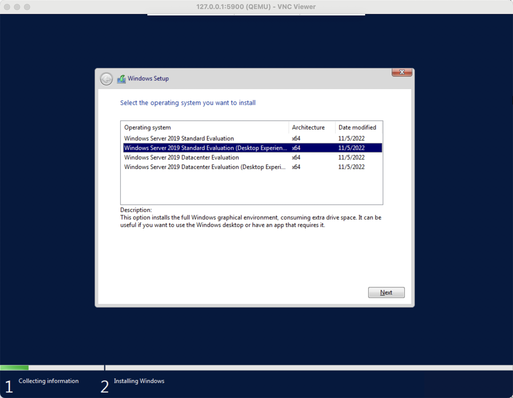
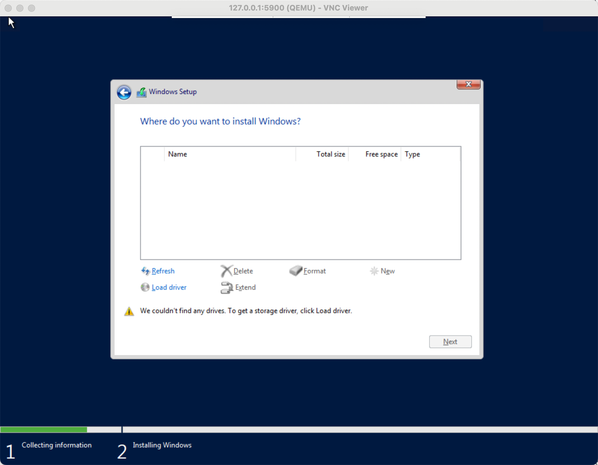
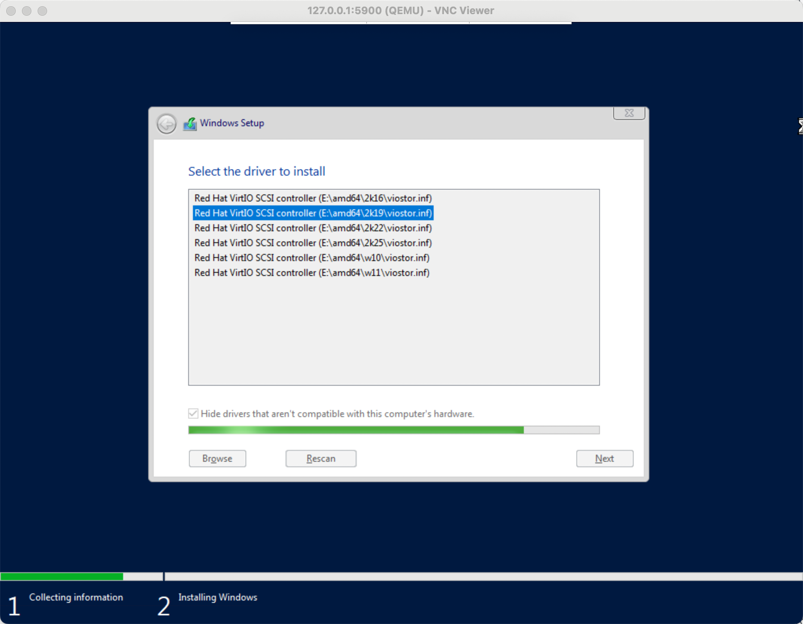
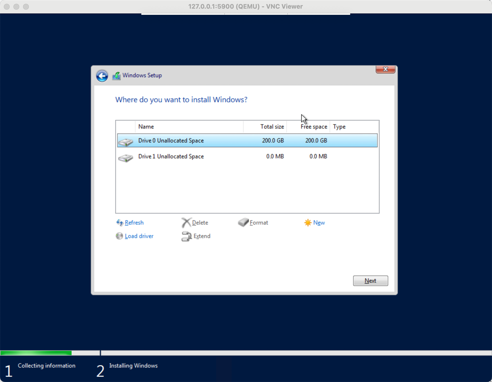

## Introduction

This document describes how to build a Windows image for `Runner`.

## Prepare

- virtio driver https://pve.proxmox.com/wiki/Windows_VirtIO_Drivers
- windows iso
- cloudbase-init https://cloudbase.it/cloudbase-init/#download

## Create a blank disk image

```bash
qemu-img create -f qcow2 windows.qcow2 200G
```

It creates a black qemu image with 200G size and qcow2 format.

## Run tool

```bash

```

## Use socat to forward VNC

```bash
socat TCP-LISTEN:5900,reuseaddr,fork UNIX-CONNECT:vnc.sock
```

## Normal installation



## Install virtio disk drivers



You cannot see the disk because the virtio driver is not installed.

Click `Load driver`, the installer will load the driver from the virtio iso.

Select the correct version of the driver.
Now, you can see the disk.

Create a new partition with `new` button.


## Install virtio full driver

Install full driver to get network and other drivers from virtio iso.

## Install Cloudbase-init

- Install
- enable console log.

## Disable firewall

## Disable UAC

## Disable Updates

- https://manage.accuwebhosting.com/knowledgebase/4898/How-to-disable-Windows-Update-on-Windows-Server-2019.html

## Notice

- Enable UTF8 in Windows if you installed Chinese version